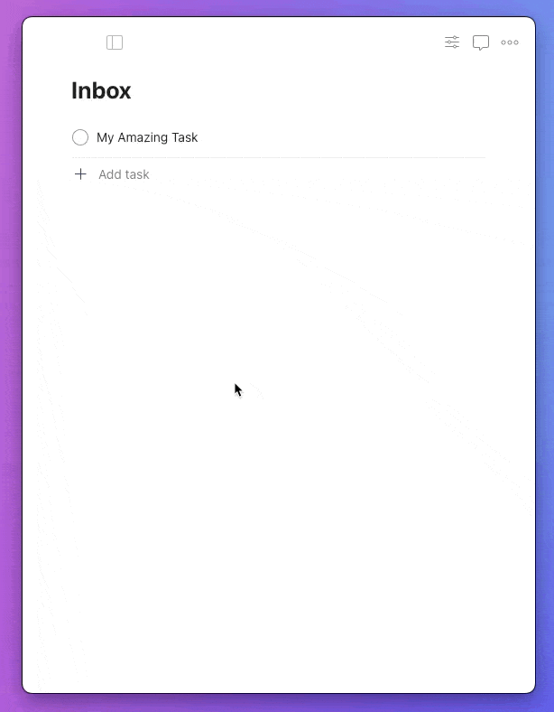

# Todoist Timer Integration 

## [Quick Install](https://app.todoist.com/app/install/28183_9f2d5d282ea6a000f3cc9d7f)

## Showcase

## Usage

The Todoist Timer Integration is a Todoist UI Extension that offers the following functionality:

### Start Timer

Starts a Timer for a given Task or Subtask. Once a Timer has been started, a comment is added to the Task for future reference. This feature can be disabled in the Extension's Settings. **Note:** The lapsed time is not currently displayed until the timer has been stopped.

### Stop Timer

Stops an active Timer on a given Task or Subtask. Once a Timer has been stopped, the Task is automatically closed and a comment is added to the Task showing the duration of the Timer. Auto-Closing and comments can be disabled in the Extension's Settings.

### Settings

Right now the extension supports two settings:

- **Automatically close task when stopping timer**:
  - Default: `enabled`
  - Behavior: When enabled, tasks are automatically completeted when the Timer is stopped
- **Track timer updates with comments**:
  - Default: `enabled`
  - Behavior: When enabled, comments are added to tasks automatically when the Timer is started or stopped

## Local Development

1. `yarn install`
2. `yarn dev` or `docker compose up -d --build`

## Deployment

The Todoist Timer Integration is hosted on Fly.io with a PostgreSQL Database.

It is accessible via https://todoist-timer.mike.fun or https://todoist-integration.fly.dev.

## TODO

- [ ] Setup Webhooks to automatically stop a timer when completed, possibly allow this as a Settings Extension
- [ ] Add Icons to README and App
- [ ] Decide on silly name for this
- [ ] Rename Fly.io configuration to new name
